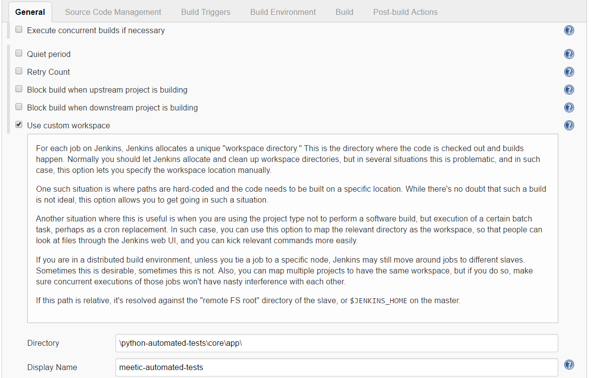
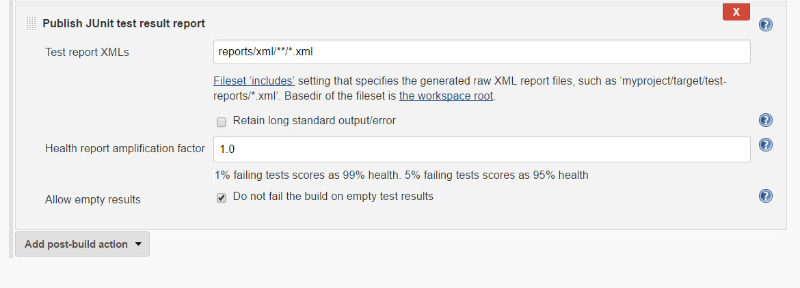
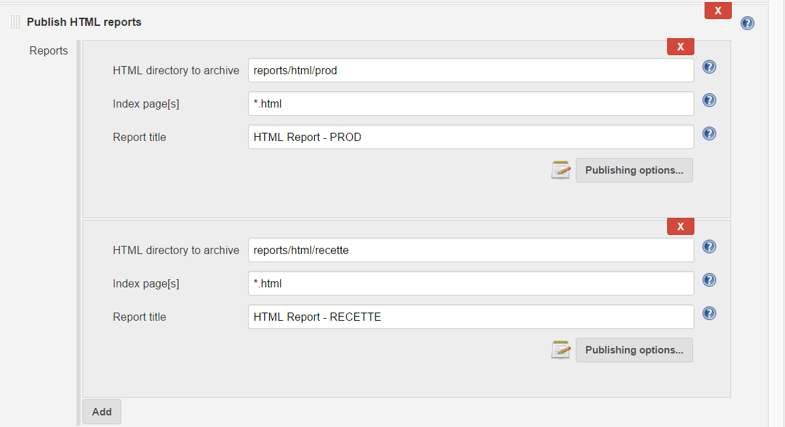
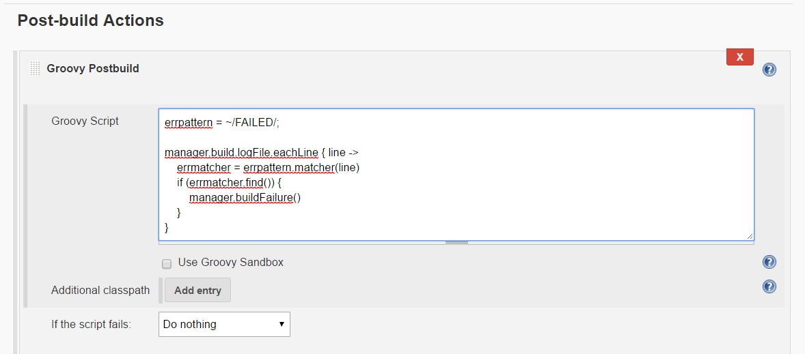

### Requirements:
* [hmtlpublisher](https://plugins.jenkins.io/htmlpublisher)
* [junit](https://plugins.jenkins.io/junit)
* [Groovy Postbuild Plugin](http://wiki.jenkins-ci.org/display/JENKINS/Groovy+Postbuild+Plugin)
* [Pipeline+Groovy+Plugin](https://wiki.jenkins-ci.org/display/JENKINS/Pipeline+Groovy+Plugin)

### Build Configuration

Check list:
* install requirements
* create a Freestyle project build
* use custom workspace ?

* execute shell build

````
#!c:\cygwin64\bin\bash
python /core/app/Main.py
````

* configure post build actions

### Post build actions:

* publish-xml-reports


* publish-html-reports


* groovy-postbuild


```
errpattern = ~/FAILED/;

manager.build.logFile.eachLine { line ->
    errmatcher = errpattern.matcher(line)
    if (errmatcher.find()) {
        manager.buildFailure()
    }
}
```

### Notes
CSS may be striped because of the Content Security Policy in Jenkins

Manage Jenkins > Script console

````bash
System.setProperty("hudson.model.DirectoryBrowserSupport.CSP", "")
````
